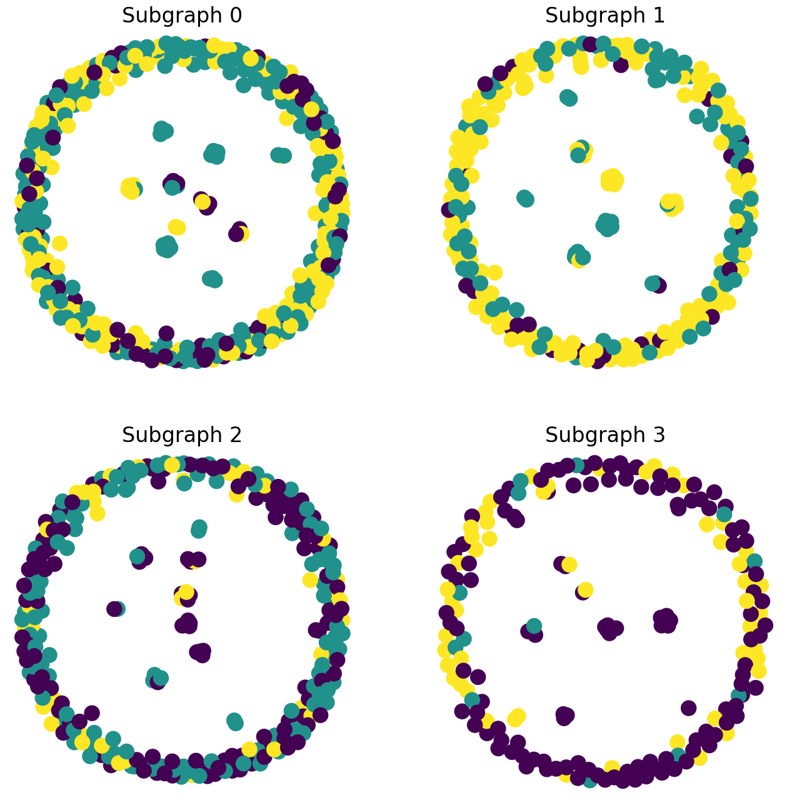

# 🌊 Hiểu và Phân Tích Biểu Đồ Của Neighbor Sampling Trong GraphSAGE

## 1️⃣ Tổng Quan Về Subgraph Trong GraphSAGE
GraphSAGE sử dụng **Neighbor Sampling** để chia nhỏ đồ thị lớn thành các **subgraph** nhỏ hơn.  
Mỗi **subgraph** chứa:
- Một nhóm **node trung tâm** (batch_size).
- Các **neighbor** của chúng được lấy theo quy tắc **num_neighbors**.
- Các **cạnh (edges)** kết nối giữa các node này.

💡 **Mục tiêu:**  
Dùng subgraph để huấn luyện mô hình mà không cần tải toàn bộ đồ thị vào bộ nhớ.

---

## 2️⃣ Vẽ Subgraph Bằng Matplotlib Và NetworkX

```python
import numpy as np
import networkx as nx
import matplotlib.pyplot as plt
from torch_geometric.utils import to_networkx

# Tạo một Figure lớn để hiển thị nhiều subgraph
fig = plt.figure(figsize=(16,16))

# Lặp qua các subgraph trong train_loader và vẽ chúng
for idx, (subdata, pos) in enumerate(zip(train_loader, [221, 222, 223, 224])):
    G = to_networkx(subdata, to_undirected=True)  # Chuyển dữ liệu từ PyG sang NetworkX
    ax = fig.add_subplot(pos)
    ax.set_title(f'Subgraph {idx}', fontsize=24)  # Đặt tiêu đề
    plt.axis('off')  # Ẩn trục tọa độ
    nx.draw_networkx(G, 
                     pos=nx.spring_layout(G, seed=0),  # Spring layout để hiển thị rõ ràng
                     with_labels=False, 
                     node_color=subdata.y)  # Tô màu node theo nhãn (label)
plt.show()
```

🔍 **Giải thích đoạn code trên:**
1. **`to_networkx(subdata, to_undirected=True)`**  
   - Chuyển đổi subgraph từ **PyG** sang **NetworkX** để vẽ.
   - `to_undirected=True` vì đồ thị không có hướng.

2. **`nx.spring_layout(G, seed=0)`**  
   - Thuật toán Spring Layout giúp node có khoảng cách hợp lý.
   - Các node có liên kết gần nhau sẽ gần nhau trên biểu đồ.

3. **`node_color=subdata.y`**  
   - Mỗi node được tô màu theo nhãn của nó (diabetes type 1, 2 hoặc experimental).

4. **`plt.axis('off')`**  
   - Ẩn trục tọa độ để chỉ tập trung vào đồ thị.

---

## 3️⃣ Hiểu Cách Đọc Biểu Đồ

### **Biểu đồ Subgraph Neighbor Sampling**


Khi hiển thị các **subgraph**, bạn sẽ thấy:
- **Các node có màu khác nhau** → thuộc các nhãn khác nhau.
- **Một số node có nhiều liên kết hơn** → chúng có thể là trung tâm của một cụm.
- **Nhiều node chỉ có một cạnh** → do neighbor sampling chỉ chọn một số lượng hàng xóm cố định.

📀 **Ví dụ về Output của Neighbor Sampling:**
```
Subgraph 0: Data(x=[400, 500], edge_index=[2, 455], y=[400], batch_size=16)
Subgraph 1: Data(x=[262, 500], edge_index=[2, 306], y=[262], batch_size=16)
Subgraph 2: Data(x=[275, 500], edge_index=[2, 314], y=[275], batch_size=16)
Subgraph 3: Data(x=[194, 500], edge_index=[2, 227], y=[194], batch_size=12)
```

📀 **Giải thích ý nghĩa:**
| Subgraph | Số node (`x`) | Số cạnh (`edge_index`) | Số node có nhãn (`y`) | batch_size |
|----------|--------------|------------------|-----------------|------------|
| **0**    | 400          | 455              | 400             | 16         |
| **1**    | 262          | 306              | 262             | 16         |
| **2**    | 275          | 314              | 275             | 16         |
| **3**    | 194          | 227              | 194             | 12         |

💡 **Những điểm quan trọng khi đọc subgraph:**
- **Subgraph có nhiều node hơn batch_size** → do nó mở rộng để lấy thêm neighbor.
- **Một số subgraph có ít hơn batch_size** → có thể do neighbor không đủ số lượng.
- **Các cạnh trong subgraph ít hơn trong toàn bộ đồ thị** → do sampling chỉ chọn một phần nhỏ của đồ thị.

---

## 4️⃣ Ý Nghĩa Của Neighbor Sampling Trong GraphSAGE
- 🔹 **Tăng tốc độ huấn luyện:** Không cần load toàn bộ đồ thị, chỉ cần một phần nhỏ.
- 🔹 **Giảm tải bộ nhớ:** Các đồ thị lớn như PubMed có **hàng trăm nghìn node**, không thể load một lúc.
- 🔹 **Bảo toàn thông tin cục bộ:** Neighbor Sampling giúp giữ lại thông tin của hàng xóm gần, giúp mô hình học được các đặc trưng quan trọng.

📣 **Tóm lại**:  
Biểu đồ **subgraph** giúp chúng ta **hiểu cách Neighbor Sampling hoạt động**, từ đó đánh giá chất lượng của việc trích xuất dữ liệu để huấn luyện **GraphSAGE** một cách hiệu quả. 🚀

